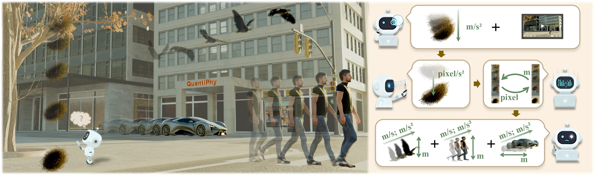

<div align="center" style="font-family: charter;">

<h1> <i>QuantiPhy</i>:</br>A Quantitative Benchmark Evaluating Physical Reasoning Abilities</br> of Vision-Language Models</h1>

<br />

<a href="https://arxiv.org/abs/2412.14171" target="_blank">
    
</a>
<a href="https://vision-x-nyu.github.io/thinking-in-space.github.io/" target="_blank">
    
</a>
<a href="https://huggingface.co/datasets/nyu-visionx/VSI-Bench" target="_blank">
    
</a>
<a href="https://huggingface.co/datasets/nyu-visionx/VSI-Bench" target="_blank">
    
</a>


<div>
    <a href="" target="_blank">Puyin Li</a><sup>1*</sup>,</span>
    <a href="https://ai.stanford.edu/~xtiange/" target="_blank">Tiange Xiang</a><sup>1*</sup>, </span>
    <a href="" target="_blank">Ella Mao</a><sup>1*</sup>,</span>
    <a href="" target="_blank">Shirley Wei</a><sup>1</sup>,</span>
    <a href="" target="_blank">Xinye Chen</a><sup>1</sup>,</span>
    <a href="" target="_blank">Adnan Masood</a><sup>2</sup>,</span>
    <a href="https://profiles.stanford.edu/fei-fei-li" target="_blank">Li Fei-Fei</a><sup>1†</sup>,</span>
    <a href="https://stanford.edu/~eadeli/" target="_blank">Ehsan Adeli</a><sup>1†</sup>,</span>
</div>

<div>
    <sup>1</sup>Stanford University&emsp;
    <sup>2</sup>UST Global&emsp;
</div>

<div>
    <sup>*</sup>Equal first authorship&emsp;
    <sup>†</sup>Equal last authorship&emsp;
</div>


<p align="justify"><i>On a crowded city street, a bird's nest falls from a branch, a car rushes by, an eagle flits over a building, and a person walks in a crosswalk — the real world is full of complex physical motion. To enable AI to understand and navigate this environment, it is essential for generalist embodied systems to reason about physical properties quantitatively. Because objects obey common laws of physics, their kinematic properties (such as size, velocity, and acceleration) are interrelated. This interdependence makes it possible for visual AI to systematically reason about these properties with respect to available priors. In this work, we present \textsc{QuantiPhy}, the first benchmark to evaluate the reasoning ability of AI models on quantitative kinematic inference tasks.</i></p>

</div>

## Overview

This repository contains the evaluation code for the **QuantiPhy** benchmark. It calculates the Multi-Region Accuracy (MRA) metric for quantitative physical reasoning tasks. The evaluation script processes model output CSV files, compares the predicted values against ground truth, and computes MRA scores across different difficulty levels (theta thresholds) and categories (S2, D2, S3, D3).


## Directory Structure

Ensure your directory is organized as follows:

```
QuantiPhy/
├── evaluator.py              # Main evaluation script
├── evaluate.sh               # Helper script to run evaluation
├── quantiphy_validation.csv  # Ground truth file for QuantiPhy validation
├── model_outputs/            # Directory for model prediction CSVs
│   ├── model_A.csv
│   └── model_B.csv
└── mra_results/              # Directory where results will be saved
```

## Usage

1. **Prepare Model Outputs**: Place your model prediction CSV files in the `model_outputs/` directory. Each CSV file should contain at least the following columns:
   - `video_id`
   - `question`
   - `parsed_value` (The numeric value extracted from the model's response)
   - `video_type` (Optional, used for categorization)
   - `inference_type` (Optional, used for categorization)

2. **Run Evaluation**: Execute the provided shell script to start the evaluation:

   ```bash
   bash evaluate.sh
   ```

   This script will:
   - Read all CSV files from `model_outputs/`.
   - Use `quantiphy_validation.csv` as the ground truth.
   - Save the aggregated results to `mra_results/all_model_results.csv`.

### Custom Usage

If you wish to use custom directories or a different ground truth file, you can run the python script directly:

```bash
python evaluator.py <input_dir> <output_dir> --gt_file <path_to_gt_csv>
```

## Output

The evaluation results are saved in `mra_results/all_model_results.csv`. This CSV file contains:

- **model**: Name of the model (derived from filename).
- **mra_average**: Average MRA score across all categories.
- **mra_S2, mra_D2, mra_S3, mra_D3**: Specific MRA scores for each category.
- **mra_bg_***: MRA scores broken down by background type.
- **mra_obj_***: MRA scores broken down by object number (single vs multiple).
- **invalid_percentage**: Percentage of responses where a valid numeric value could not be parsed.
