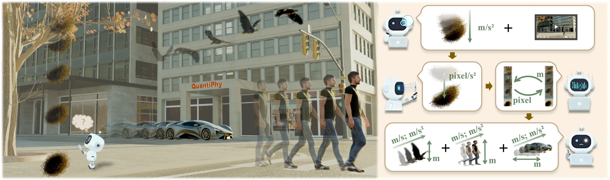

<div align="center" style="font-family: charter;">

<h1> <i>QuantiPhy</i>:</br>A Quantitative Benchmark Evaluating Physical Reasoning Abilities</br> of Vision-Language Models</h1>

<b>CVPR 2026</b>

<br />

<a href="https://arxiv.org/pdf/2512.19526" target="_blank">
    
</a>
<a href="https://quantiphy.stanford.edu/" target="_blank">
    
</a>
<a href="https://quantiphy.stanford.edu/competition/index.html" target="_blank">
    
</a>
<a href="https://huggingface.co/datasets/PaulineLi/QuantiPhy" target="_blank">
    
</a>
<a href="https://huggingface.co/datasets/PaulineLi/QuantiPhy-validation" target="_blank">
    
</a>

<br />


<div>
    <a href="https://www.linkedin.com/in/puyin-li-32709a299" target="_blank">Puyin Li</a><sup>1*</sup>,</span>
    <a href="https://ai.stanford.edu/~xtiange/" target="_blank">Tiange Xiang</a><sup>1*</sup>, </span>
    <a href="https://www.gsb.stanford.edu/programs/phd/academic-experience/students/ella-mao" target="_blank">Ella Mao</a><sup>1*</sup>,</span>
    <a href="https://www.linkedin.com/in/shirley-jinshan-wei-611545328" target="_blank">Shirley Wei</a><sup>1</sup>,</span>
    <a href="https://www.paprikachen.com" target="_blank">Xinye Chen</a><sup>1</sup>,</span>
    <a href="https://www.ust.com/en/boundless/boundless-thinkers/adnan-masood-phd" target="_blank">Adnan Masood</a><sup>2</sup>,</span>
    <a href="https://profiles.stanford.edu/fei-fei-li" target="_blank">Li Fei-Fei</a><sup>1†</sup>,</span>
    <a href="https://stanford.edu/~eadeli/" target="_blank">Ehsan Adeli</a><sup>1†</sup>,</span>
</div>

<div>
    <sup>1</sup>Stanford University&emsp;
    <sup>2</sup>UST&emsp;
</div>

<div>
    <sup>*</sup>Equal first authorship&emsp;
    <sup>†</sup>Equal last authorship&emsp;
</div>


<p align="justify"><i>On a crowded city street, a bird's nest falls from a branch, a car rushes by, an eagle flits over a building, and a person walks in a crosswalk — the real world is full of complex physical motion. To enable AI to understand and navigate this environment, it is essential for generalist embodied systems to reason about physical properties quantitatively. Because objects obey common laws of physics, their kinematic properties (such as size, velocity, and acceleration) are interrelated. This interdependence makes it possible for visual AI to systematically reason about these properties with respect to available priors. In this work, we present \textsc{QuantiPhy}, the first benchmark to evaluate the reasoning ability of AI models on quantitative kinematic inference tasks.</i></p>

</div>

## 🏆 QuantiPhy Challenge @ NeurIPS 2026

**QuantiPhy has been accepted to the [NeurIPS 2026 Competition Track](https://quantiphy.stanford.edu/competition/index.html)!** The challenge is now **live** — you can submit your model's predictions through the official evaluation portal and get scored on the leaderboard.

- **Competition website:** https://quantiphy.stanford.edu/competition/index.html
- **Submission deadline:** November 5, 2026, 23:59 AOE
- **How to submit:** Register a team (up to 5 members), run your model on the [test set](https://huggingface.co/datasets/PaulineLi/QuantiPhy), format predictions as a single CSV matching the reference submission template, and upload it through the submission portal (up to 3 scored submissions per day).
- **Tracks:** *Track A (Main)* — any model permitted, ranked by raw numerical accuracy. *Track B (Open-Weight)* — restricted to publicly available model weights and tools for reproducibility.
- **Metric:** Mean Relative Accuracy (MRA), computed with the code in this repo (see below).
- **Prizes (per track):** 1st — \$1,000 + oral · 2nd — \$500 + spotlight · 3rd — \$250 + poster.

Use the starter code in this repository to run a VLM on QuantiPhy and validate your submission format locally before uploading.

## Overview

This repository contains the evaluation code for the **QuantiPhy** benchmark, as well as an example script for running VLMs on QuantiPhy. It calculates the Multi-Region Accuracy (MRA) metric for quantitative physical reasoning tasks. The evaluation script processes model output CSV files, compares the predicted values against ground truth, and computes MRA scores across different difficulty levels (theta thresholds) and categories (S2, D2, S3, D3).

## Datasets

| Split | Link | Description |
|-------|------|-------------|
| **QuantiPhy dataset** (3,373 QA pairs, 556 videos) | [PaulineLi/QuantiPhy](https://huggingface.co/datasets/PaulineLi/QuantiPhy) | Official full dataset — ground-truth answers withheld |
| **Validation set** (159 QA pairs) | [PaulineLi/QuantiPhy-validation](https://huggingface.co/datasets/PaulineLi/QuantiPhy-validation) | Validation split with ground-truth answers for development and ablation |

## Directory Structure

Ensure your directory is organized as follows:

```
QuantiPhy/
├── evaluator.py              # Main evaluation script
├── evaluate.sh               # The script to launch evaluation
├── model_outputs/            # Directory for model prediction CSVs
│   ├── model_A.csv
│   └── model_B.csv
│   └── ...
├── mra_results/              # Directory where results will be saved
└── model_run_example/        # Example script for running a VLM on QuantiPhy
    ├── run_API_results.py    # Main VLM inference script (OpenAI API)
    ├── GT_CIB_Ready/         # Example ground truth CSV
    ├── data/all_480p/        # Example videos (.mp4)
    └── vlm_results_release/  # Output directory for model predictions
```

## Use case 1: Running a VLM on QuantiPhy

`model_run_example/run_API_results.py` is a ready-to-use inference script that queries an OpenAI-compatible VLM (GPT-5 / GPT-5.1) for each video–question pair and writes the predictions to a CSV that can be fed directly into the evaluator.

### Setup

```bash
pip install opencv-python pandas numpy openai
export OPENAI_API_KEY="sk-xxxxxxxxxxxxxxxx"
```

### Download data

1. Download videos and the metadata CSV from the HuggingFace dataset page:
   - **Validation set** (with ground truth): [PaulineLi/QuantiPhy-validation](https://huggingface.co/datasets/PaulineLi/QuantiPhy-validation)
   - **Full test set**: [PaulineLi/QuantiPhy](https://huggingface.co/datasets/PaulineLi/QuantiPhy)
2. Place the videos in `model_run_example/data/all_480p/` and update the `VIDEO_DIR` and `CSV_FILE` variables at the top of `run_API_results.py` if needed.

### Run

```bash
cd model_run_example
python run_API_results.py
```

The script will prompt you to select:
- **Prompting method**: `1` Zero-shot &nbsp;|&nbsp; `2` Chain-of-Thought (CoT)
- **Zero-shot version** (if applicable): `1` No video &nbsp;|&nbsp; `2` Counterfactual prior &nbsp;|&nbsp; `3` Original *(recommended)*
- **Provider**: press Enter for the default (`gpt5`), or enter `gpt5.1`

Results are saved to `model_run_example/vlm_results_release/tables/` as a timestamped CSV, which you can pass directly to the evaluator.

## Use case 2: Evaluation on QuantiPhy-validation

1. **Obtain Data**: Follow the instructions on our [HuggingFace page](https://huggingface.co/datasets/PaulineLi/QuantiPhy-validation) to download the necessary data needed for evaluating on QuantiPhy-validation:
   * `validation_videos`: The folder contains videos in the validation set.
   * `quantiphy_validation.csv`: Metadata, question, prior, and ground truth annotations in the validation set. Put the CSV file anywhere you like, but **remember to update the `gt_file` variable in `evaluate.sh`.**


2. **Obtain Results**: For all items in the validation CSV file, run your VLM with the corresponding `question` and `prior` along with the linked video to obtain the results. The results should follow the same structure as the example output in `model_outputs/gpt-5.1.csv`.


3. **Prepare Outputs**: Place your model prediction CSV files in the `model_outputs/` directory. Each CSV file should contain at least the following columns:
   - `video_id`
   - `question`
   - `parsed_value` (The numeric value extracted from the model's response)
   - `video_type` (Optional, used for categorization)
   - `inference_type` (Optional, used for categorization)

4. **Run Evaluation**: Execute the provided shell script to start the evaluation:

   > **Note**: Please update `evaluate.sh` with your local paths before running evaluation.

   ```bash
   bash evaluate.sh
   ```

   This script will:
   - Read all CSV files from `model_outputs/`.
   - Use `quantiphy_validation.csv` as the ground truth.
   - Save the aggregated results to `mra_results/all_model_results.csv`.

## Output

The evaluation results are saved in `mra_results/all_model_results.csv`. This CSV file contains:

- **model**: Name of the model (derived from filename).
- **mra_average**: Average MRA score across all categories.
- **mra_S2, mra_D2, mra_S3, mra_D3**: Specific MRA scores for each category.
- **mra_bg_***: MRA scores broken down by background type.
- **mra_obj_***: MRA scores broken down by object number (single vs multiple).
- **invalid_percentage**: Percentage of responses where a valid numeric value could not be parsed.


## Citation

If you find this work useful in your research or project, please cite:

```bibtex
@article{li2025quantiphy,
      title   = {QuantiPhy: A Quantitative Benchmark Evaluating Physical Reasoning Abilities of Vision-Language Models},
      author  = {Li, Puyin and Xiang, Tiange and Mao, Ella and Wei, Shirley and Chen, Xinye and Masood, Adnan and Li, Fei-Fei and Adeli, Ehsan},
      journal = {arXiv preprint arXiv:2512.19526},
      year    = {2025}
    }
```